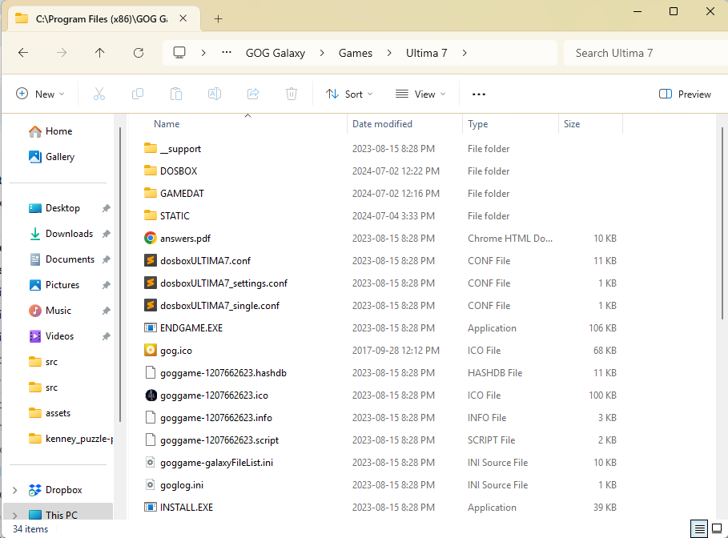
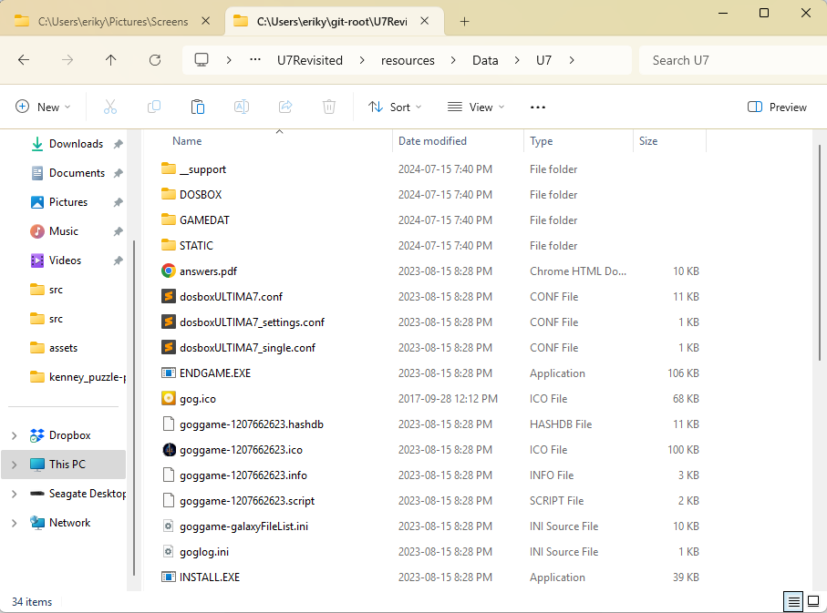

# Ultima VII: Revisited

Welcome to Ultima VII: Revisited, my attempt to write a replacement engine for Ultima VII: The Black Gate.

## Installation and Running the Engine

To run this program, you will need to copy the contents of your original DOS ULTIMA7 folder to `/Data/u7`.  This
will allow the replacement engine to read in the maps and graphics from the original files.

- Locate your Ultima 7 game files (eg. `C:\Program Files (x86)\GOG Galaxy\Games\Ultima 7`)

- Copy ALL of these files, folders and subfolders into `./Data/U7` (*hint: look for the `U7.txt` file*)

## Developer Installation Notes

- Clone the project into a local folder using whatever git interface you prefer
- Copy the entire contents of your original DOS ULTIMA7 directory to `$(SolutionDir)/Redist/Data/U7/`
- Make sure you have the [Meson Build system](https://mesonbuild.com/) installed
- Run `meson setup build`, or if you want to generate a Visual Studio project, `meson setup --backend vs build`
- Run `meson compile -C build` to build the project
- Go to `build/` directory and run the `u7revisited` program

## Controls:

- `WASD`:  Move around.
- `Q/E`:  Rotate left and right.
- `Mousewheel`:  Zoom in/Zoom out.
- To teleport to a location, left-click there in the minimap.
- Press `ESC` to exit.

This is an open source project, which means that you can grab the source files from github.com/viridiangames and
build it yourself!

**FEEDBACK IS WELCOME BOY HOWDY IS IT WELCOME!** 

The best way to give feedback is to send it to my email address anthony.salter@gmail.com and put `Revisited` in
the subject line.

Have fun, and Rule Britannia.
